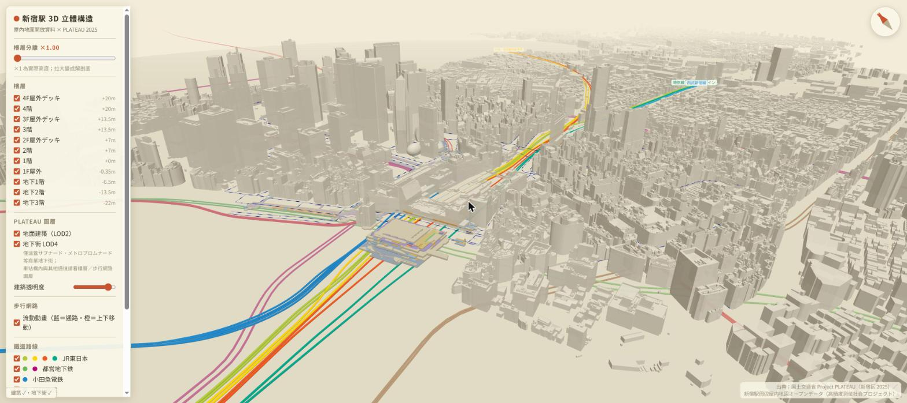

# 新宿駅 3D 立體構造 Viewer

以開放資料重現《ザ・新宿駅解体》風格的新宿站分層立體圖：
車站站內樓層（B3–4F）用「新宿駅周辺屋内地図オープンデータ」擠出建模，
地面建築與地下街則直接串流 Project PLATEAU 新宿區 2025 年度 3D Tiles。



## 快速開始

```bash
npm install
npm run dev   # http://localhost:5620（5173 已被其他服務占用）
```

## 功能

- **樓層分離滑桿**：×1 為實際高度，拉大變成解剖圖（分離時 PLATEAU 地下街自動隱藏，避免與實寸模型混淆；步行網路與地下鐵道路線同步展開）
- **樓層開關**：B3–4F 共 11 層（含 2F–4F 屋外人行平台）
- **PLATEAU 圖層**：地面建築 LOD2 新宿区＋渋谷区（乳白色，可調透明度與顯示半徑 0.4–2.6km，shader 圓形裁切淡出）、地下街 LOD4（僅サブナード・メトロプロムナード等商業地下街，含貼圖；完整通路網請看樓層／步行網路圖層）
- **步行網路流動動畫**：歩行空間ネットワーク 1,866 條 link 的 GLSL 流動光點（藍＝通路、橙＝樓梯/電扶梯/電梯等上下移動），高度依 node 樓層屬性內插
- **地下補完（OSM 2026 現況）**：1,042 條行人地下道（含 2023 年開通的タイムズアベニューIII期-1、甲州街道地下～高島屋連絡、新宿御苑方面）＋周邊地鐵站站廳面＋通道名標籤（メトロプロムナード・都庁前プロムナード・東西自由通路・京王モール各通り等 11 處）——補齊 2020 年版政府資料缺漏的段落
- **建物地下量體（推定）**：OSM `building:levels:underground` 133 棟，足跡 × 層數×3.5m 向下擠出（半透明褐色）；注意 OSM 此標籤僅部分建物有標，非完整涵蓋
- **全線月台**：OSM railway=platform 45 面＋12 線（JR 地面群・小田急 B1・京王/丸ノ内線 B2・新宿線 B5・大江戸線 B7・都庁前・新宿三丁目・西新宿・御苑前…），深度依 level 標籤對映
- **現場直播攝影機**：9 支新宿 YouTube livecam（歌舞伎町一番街×2・テイケイ4K×3・西武新宿pepe前・鉄道ライブ・大ガード・東口猫の目線），全數以 isLiveNow 驗證後收錄；LIVE 圖示釘在實際位置，點擊開嵌入視窗（附「在 YouTube 開啟」連結）。直播 ID 輪替失效時執行 `tools/check_livecams.sh` 檢查、依條目 ch 頻道找新 ID
- **鐵道路線**：16 條路線依官方線色的管狀模型＋路線名標籤，依營運商開關（JR東日本・小田急・京王・東京メトロ・都営・西武）；地下線深度為概略值
- **出入口編號**：118 個地鐵出入口徽章（A・B・C・D・E・N・S 系，OSM ref）
- **地面底圖**：國土地理院淡色地圖／航空写真瓦片拼接鋪地（z17、約 3km 見方、可調透明度），與 ENU 座標對齊
- **A→B 導航**：步行網路即導航圖（link 端點即節點），Dijkstra 最短路徑（垂直移動 1.8 倍加權），紅色路徑管＋起終點標記＋距離資訊；點按鈕後直接在場景點選
- **墨線描邊（手繪風）**：法線＋深度 Sobel 後處理，向《ザ・新宿駅解体》的手繪質感靠攏，可開關
- **人流粒子**：1,600 顆粒子沿步行網路移動（依 link 長度加權抽樣、CPU 更新），與樓層分離連動
- **上色模式**：依空間類別（依官方地物凡例 19 類）／改札內（收費區）強調
- **羅盤**：隨視角旋轉，點擊回正北
- 出入口以洋紅色線標示（同官方凡例）

## 架構

| 檔案 | 說明 |
|---|---|
| `tools/convert_indoor.py` | Shapefile（JGD2011 經緯度）→ 局部 ENU 座標 JSON（pyshp，無需 GDAL） |
| `tools/convert_network.py` | 歩行空間ネットワーク link/node GeoJSON → 流動動畫 JSON（樓層高度內插） |
| `tools/convert_rail.py` | OSM Overpass 鐵道資料 → 各路線線形＋線色＋概略深度 JSON |
| `tools/convert_tunnels.py` | OSM 行人地下道（tunnel=yes 等）＋站廳面 → 補完圖層 JSON |
| `tools/convert_platforms.py` | OSM railway=platform → 月台板 JSON（level → 深度） |
| `public/data/*.json` | 轉檔輸出（indoor 532KB / network 132KB / tunnels 64KB / platforms / rail 44KB） |
| `src/config.js` | 場景原點、tileset URL、樓層高度、category 顏色表 |
| `src/indoor.js` | ExtrudeGeometry 樓層建模（依 category 合併 geometry 減少 draw call） |
| `src/network.js` | 步行網路 LineSegments＋GLSL 流動 shader（uSep 與分離滑桿連動） |
| `src/rail.js` | 鐵道 TubeGeometry＋Canvas Sprite 路線標籤 |
| `src/tiles.js` | 3d-tiles-renderer 串流 PLATEAU（ReorientationPlugin 對齊原點） |
| `src/main.js` | 場景、相機、UI、羅盤 |

### 座標對齊

兩邊都以 WGS84 橢球在 `(139.7005, 35.6900)` 的 ENU 切平面為基準：

- 屋內資料：轉檔時逐點 ECEF→ENU（`tools/convert_indoor.py`）
- PLATEAU tiles：`ReorientationPlugin` 將同一經緯度置於原點（X 西、Z 北），外層 group 旋轉 180° 轉成場景座標（X 東、Z 南）
- 高度：新宿站地面標高 37.5m（GSI DEM）+ 大地水準面差約 36.7m = 橢球高 74.2m，見 `GROUND_ELLIPSOIDAL_H`

## 資料來源與授權

| 資料 | 來源 | 授權 |
|---|---|---|
| 屋內地圖（車站站內 B3–4F） | [新宿駅周辺屋内地図オープンデータ 令和2年度更新版](https://www.geospatial.jp/ckan/dataset/mlit-indoor-shinjuku-r2)（国土交通省 高精度測位社会プロジェクト） | 見資料集利用規約 |
| 步行網路 | [歩行空間ネットワークデータ（東京都）新宿駅周辺 2020年3月版](https://www.geospatial.jp/ckan/dataset/0401)（国土交通省） | 見資料集利用規約 |
| 地面建築・地下街 3D Tiles | [Project PLATEAU 新宿区 2025 年度](https://www.geospatial.jp/ckan/dataset/plateau-13104-shinjuku-ku-2025)（国土交通省）， 由 PLATEAU 配信サービス串流 | [PLATEAU Site Policy](https://www.mlit.go.jp/plateau/site-policy/)（商用可，需標示出典） |
| 鐵道線形・地下通道・站廳・月台 | OpenStreetMap（Overpass API） | © OpenStreetMap contributors, ODbL |
| 地面標高 | 国土地理院 標高API | — |

公開發布時請保留畫面右下角出典標示。

## 已知限制／後續方向

- 樓層高度為推定值（屋內資料無高度屬性）；鐵道地下線深度為概略值（非實測）
- 屋內資料與 PLATEAU 地下街在東口一帶有部分重疊（兩份資料的整備範圍不同）
- 屋內資料為令和2年度（2020）版；之後的站體改建（如西口再開發）未反映
- 步行網路 floor=1 節點的高度解讀（1F 室內 vs 2F 平台）為推定
- 頂視角時 LOD2 建築屋頂與地面同色系、辨識度低
- 後續：點擊顯示空間資訊、依鐵道公司標註改札內歸屬、PLATEAU MVT 道路底圖、
  月台模型（PLATEAU 2025 有 rwy 鉄道模型可試）
